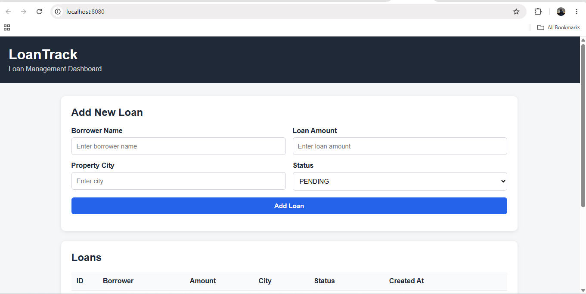
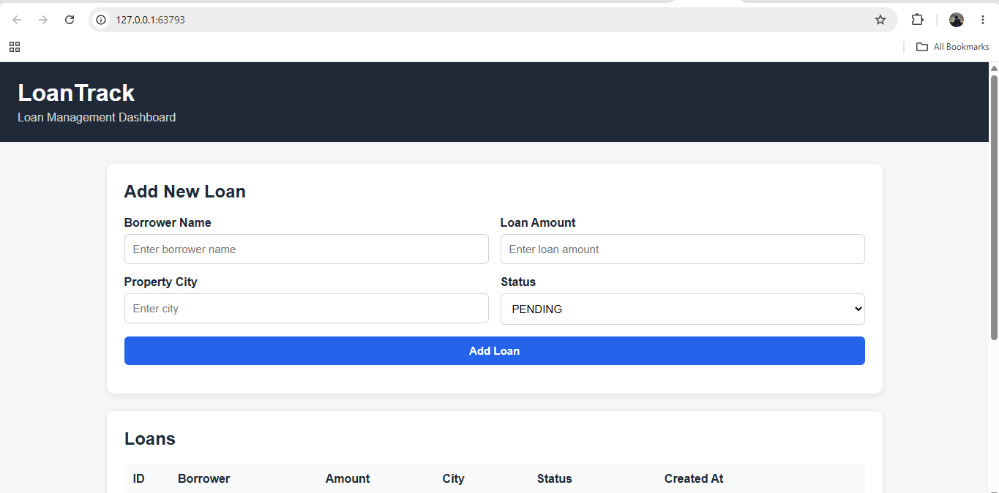

# LoanTrack

LoanTrack is a three-tier loan tracking application consisting of:

- Frontend: Nginx serving the web UI
- Backend: FastAPI REST API
- Database: PostgreSQL

The application is designed to run locally using Docker Compose and Kubernetes.

---

## Architecture

    Browser
       |
       v
    +-------------------+
    |     Frontend      |
    |      Nginx        |
    |     :8080         |
    +---------+---------+
              |
           HTTP /api
              |
              v
    +-------------------+
    |      Backend      |
    |      FastAPI      |
    |      :8000        |
    +---------+---------+
              |
          PostgreSQL
            :5432
              |
              v
    +-------------------+
    |     PostgreSQL    |
    |       loans       |
    +-------------------+
              |
              v
       Persistent Storage

Docker Compose:

    frontend -> backend -> db

    db uses a named persistent volume.

Kubernetes:

    frontend -> NodePort
    backend  -> ClusterIP
    postgres -> ClusterIP + StatefulSet + PVC

The frontend never connects directly to PostgreSQL. All database communication goes through the FastAPI backend.

---

## Tool Versions

| Tool | Version |
|---|---|
| Python | 3.12 |
| FastAPI | 0.116.1 |
| Uvicorn | 0.35.0 |
| psycopg | 3.2.10 |
| psycopg-pool | 3.2.6 |
| PostgreSQL | 17.11 |
| Nginx | 1.29-alpine |
| Kubernetes | v1.35.1 |
| minikube | v1.38.1 |
| minikube Driver | Docker |
| Docker Compose | v2 |

---

## Docker Compose

### Setup

Create the environment file from the example:

    Copy-Item .env.example .env

Start the application:

    docker compose up -d

Check the containers:

    docker compose ps

Open the application:

    http://localhost:8080

Stop the application:

    docker compose down

To completely reset the database:

    docker compose down -v

PostgreSQL uses a named volume, so normal `docker compose down` preserves database data.

The database also has a health check, and the backend waits for the database to become healthy before starting.

---

## Docker Design Decisions

### Backend Base Image

The backend uses:

    python:3.12-slim-bookworm

The slim Python image provides the required Python runtime while keeping the image smaller than the full Python image. It also provides good compatibility with the required Python dependencies.

### Layer-Cache Boundary

The Dockerfile installs dependencies before copying application source code:

    requirements.txt
          |
          v
    Install dependencies
          |
          v
    Copy application source

This creates a cache boundary. If only application code changes, Docker can reuse the dependency installation layer instead of installing dependencies again.

The backend also uses a multi-stage build so unnecessary build dependencies are not included in the final runtime image.

### Non-Root Containers

The backend runs as the non-root user:

    appuser

Running containers as non-root follows the principle of least privilege and reduces security risk.

---

## Kubernetes

Start minikube:

    minikube start --driver=docker

Check the cluster:

    kubectl get nodes

### One-Command Deployment

The project includes:

    scripts/deploy.sh

On Windows using Git Bash:

    & "C:\Program Files\Git\bin\bash.exe" scripts/deploy.sh

The deployment script builds the application images, creates the namespace and required configuration, deploys PostgreSQL, backend and frontend in order, waits for rollouts and prints the application URL.

Open the application with:

    minikube service frontend -n loantrack --url

### Manual Deployment

    kubectl apply -f k8s/namespace.yaml
    kubectl apply -f k8s/configmap.yaml
    kubectl apply -f k8s/postgres.yaml
    kubectl apply -f k8s/backend.yaml
    kubectl apply -f k8s/frontend.yaml

Check all resources:

    kubectl get all -n loantrack

Check storage, ConfigMap and Secret:

    kubectl get pvc,configmap,secret -n loantrack

---

## Kubernetes Architecture

    Browser
       |
       v
    Frontend NodePort
       |
       v
    Frontend Deployment
       |
       v
    Backend ClusterIP
       |
       v
    Backend Deployment
       |
       v
    PostgreSQL ClusterIP
       |
       v
    PostgreSQL StatefulSet
       |
       v
    PersistentVolumeClaim

---

## Design Decisions

### StatefulSet vs Deployment

The frontend and backend are stateless workloads, so they use Kubernetes Deployments.

PostgreSQL is a stateful workload that requires persistent storage, so it uses a StatefulSet with a `volumeClaimTemplate`.

StatefulSet provides stable identity and persistent storage association, making it more appropriate for PostgreSQL.

Therefore:

    Frontend  -> Deployment
    Backend   -> Deployment
    PostgreSQL -> StatefulSet

### Liveness vs Readiness

The backend provides two health endpoints:

    /healthz
    /readyz

Liveness checks whether the backend process is alive. It does not depend on PostgreSQL.

Readiness checks whether the backend can communicate with PostgreSQL.

    /healthz -> Process alive?
    /readyz  -> Database reachable?

Keeping these checks separate prevents Kubernetes from unnecessarily restarting a healthy backend when PostgreSQL is temporarily unavailable. Instead, Kubernetes can simply mark the backend as not ready and stop sending traffic to it until the database becomes available.

### CPU Limit vs Memory Limit

CPU and memory limits behave differently in Kubernetes.

CPU:

When a container reaches its CPU limit, Kubernetes throttles CPU usage. The container normally continues running but may become slower.

Memory:

If a container exceeds its memory limit, it can be terminated with an Out Of Memory (OOM) condition and Kubernetes may restart it.

Therefore memory limits must be selected carefully.

---

## Kubernetes Secrets

Database credentials are stored using a Kubernetes Secret and injected into the application using Secret references.

Only example/dummy values are committed in:

    k8s/secret.example.yaml

Real credentials are not committed to Git.

### Why Base64 Is Not Encryption

Kubernetes Secret values are commonly represented using Base64.

Base64 is an encoding mechanism, not encryption.

    Base64 != Encryption

A Base64 value can easily be decoded, so Base64 alone does not provide confidentiality.

### Production Secret Solution

For production, secrets should be stored in a dedicated secret-management system such as:

- AWS Secrets Manager
- HashiCorp Vault
- Azure Key Vault
- Google Secret Manager

For example, AWS Secrets Manager can be integrated with Kubernetes so database credentials are retrieved securely at runtime.

Production environments should also use RBAC, encryption at rest, TLS, auditing and secret rotation.

---

## Health Checks

Backend endpoints:

    GET /healthz
    GET /readyz

`/healthz` checks that the backend process is alive.

`/readyz` checks that the backend can reach PostgreSQL.

Docker uses a backend health check.

Kubernetes uses liveness and readiness probes.

PostgreSQL also has health/readiness checks.

---

## Kubernetes Operations

Scale the backend:

    kubectl scale deployment backend -n loantrack --replicas=3

Check rollout:

    kubectl rollout status deployment/backend -n loantrack

Rollback:

    kubectl rollout undo deployment/backend -n loantrack

View pods:

    kubectl get pods -n loantrack

Delete a backend pod to demonstrate self-healing:

    kubectl delete pod <backend-pod-name> -n loantrack

Kubernetes automatically creates a replacement backend pod to maintain the desired replica count.

PostgreSQL uses persistent storage, so recreating the PostgreSQL pod does not remove stored loan data.

---

## Screenshots

### Docker Compose

### Kubernetes

---

## Git Workflow

The project uses the following branching model:

    main
      |
      +-- develop
            |
            +-- feature/application-foundation
            +-- feature/docker-compose
            +-- feature/kubernetes
            +-- feature/evidence

`main` is kept deployable and changes are merged through Pull Requests.

Docker milestone:

    v1.0.0

Kubernetes milestone:

    v1.1.0

---

## Security

- `.env` is excluded from Git.
- Database credentials are not hard-coded in application code.
- Real Kubernetes Secret values are not committed.
- The frontend has no direct database access.
- Containers run as non-root users.
- Base images are version-pinned.
- `.dockerignore` excludes sensitive and unnecessary files.

---

## Evidence

Detailed verification, command outputs, troubleshooting examples and operational evidence are available in:

    EVIDENCE.md

AI usage is documented in:

    AI_USAGE.md

Branching strategy is documented in:

    BRANCHING.md